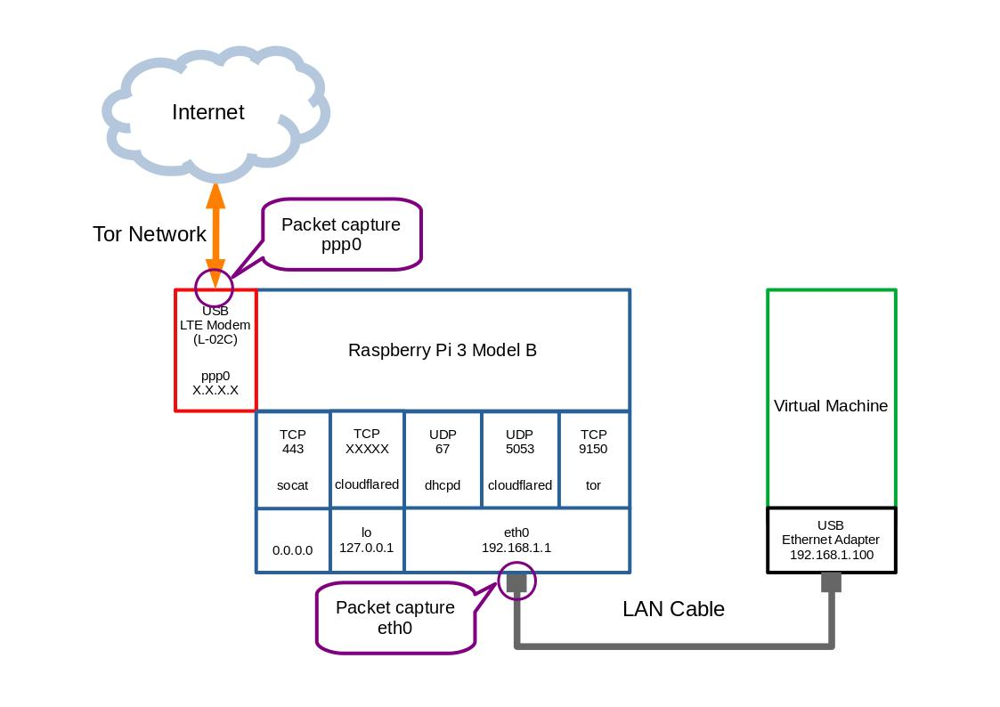

# Raspberry Pi LTE Router for Tor

## Summary


- Packet Flow
    - Virtual Machine <=> Raspberry Pi
        - TCP Packet
            - USB Ethernet Adapter <= TCP => eth0 TCP <= redirect => eth0 TCP9040(tor transport)
            - USB Ethernet Adapter <= TCP => eth0 TCP9150(tor socksport)
        - DNS Packet
            - USB Ethernet Adapter <= DNS => eth0 UDP53 <= redirect => eth0 UDP5053(cloudflared)
        - DHCP Packet
            - USB Ethernet Adapter <= DHCP => eth0 UDP67(dhcpd)
    - Raspberry Pi
        - DNS Packet
            - lo TCP?????(cloudflared) <= TLS => lo(dns4torpnlfs2ifuz2s2yf3fc7rdmsbhm6rw75euj35pac6ap25zgqad.onion) TCP443(socat, fork 0.0.0.0 TCP443) <= TLS => eth0 TCP9150(tor socksport)
    - Raspberry Pi <=> Tor Network
        - TCP and DNS Packets of Virtual Machine
            - USB LTE Modem ppp0 <= TLS => Tor Network


## Preparation
- Raspberry Pi 3 Model B
    - Raspbian GNU/Linux 10(buster)
- USB LTE Modem
    - LG L-02C
- Nano SIM
- Nano SIM Adapter Converter(from Nano SIM to SIM)
- USB Ethernet Adapter(USB2.0)
- LAN Cable
- Real Time Clock module
    - RTC DS1307


## Setup
### Setting Up Raspberry pi
- Install raspbian buster
- Install software
    ````
    sudo apt update
    sudo apt upgrade
    sudo apt install vim git iptables iptables-persistent wireshark tshark macchanger proxychains4 isc-dhcp-server dnsutils curl socat i2c-tools busybox cryptsetup initramfs-tools
    sudo apt install expect --no-install-recommends -y
    ````
- Install software for USB LTE Modem(L-02C)
    ````
    sudo apt install ppp eject usb-modeswitch wvdial
    ````
- Install software for docker
    ````
    sudo sh -c 'curl -sSL https://get.docker.com | sh'
    ````
- Install software for cloudflared
    - Download software
        - [cloudflared-stable-linux-arm.tgz(Type:Binary,ARMv6)](https://bin.equinox.io/c/VdrWdbjqyF/cloudflared-stable-linux-arm.tgz)
    - Add cloudflared user
        ````
        sudo useradd -s /usr/sbin/nologin -r -M cloudflared
        ````
    - Unzip and install
        ````
        tar -xvzf cloudflared-stable-linux-arm.tgz
        sudo cp ./cloudflared /usr/local/bin
        sudo chmod +x /usr/local/bin/cloudflared
        sudo chown cloudflared:cloudflared /usr/local/bin/cloudflared
        cloudflared -v
        ````
- Modify /etc/sysctl.conf
    - Modify the next line in the file
        ````/etc/sysctl.conf
        net.ipv4.ip_forward=1
        ````
    - update
        ````
        sudo sysctl -p
        ````
- Setting up eth0
    - Modify /etc/network/interfaces
        - Add the next lines at the end of the file
            ````/etc/network/interfaces
            auto eth0
            iface eth0 inet static
              address 192.168.1.1
              netmask 255.255.255.0
              dns-nameserver 127.0.0.1
              up ifconfig eth0 promisc up
              down ifconfig eth0 promisc down
            ````
        - Down and up eth0
            ````
            sudo ifdown eth0
            sudo ifup eth0
            ````
- Setting up isc-dhcp-server
    - Modify /etc/default/isc-dhcp-server
        - Modify the next lines in the file
            ````/etc/default/isc-dhcp-server
            INTERFACESv4="eth0"
            INTERFACESv6=""
            ````
    - Modify /etc/dhcp/dhcpd.conf
        - Add the next lines at the end of the file
            ````/etc/dhcp/dhcpd.conf
            subnet 192.168.1.0 netmask 255.255.255.0 {
            	range 192.168.1.100 192.168.1.199;
            	option domain-name "local";
            	option domain-name-servers 192.168.1.1;
            	option routers 192.168.1.1;
            	option broadcast-address 192.168.1.255;
            	default-lease-time 600;
            	max-lease-time 7200;
            }
            ````
    - Run isc-dhcp-server
        ````
        sudo systemctl enable isc-dhcp-server.service
        sudo systemctl restart isc-dhcp-server.service
        ````

### Setting Up RTC module(RTC DS1307)
- Install the RTC module(RTC DS1307) on the Raspberry Pi
- Run the next command and enable I2C(5 Interfacing Options => P5 I2C => Yes => Ok)
    ````
    sudo raspi-config
    ````
- Modify /etc/modules
    - Add the next line in the file
        ````/etc/modules
        rtc-ds1307
        ````
- Check an address of the RTC module(0x68)
    ````
    sudo i2cdetect -y 1
    ````
- Register the RTC module
    ````
    sudo su
    modprobe rtc-ds1307
    echo ds1307 0x68 > /sys/class/i2c-1/new_device
    ````
- Check the address of the RTC module(check 'UU' displayed on 0x68 address)
    ````
    sudo i2cdetect -y 1
    ````
- Set the system clock and the hardware clock
    ````
    sudo date -s 'YYYY/MM/DD hh:mm:ss'
    date
    sudo hwclock -w
    ````
- Check the hardware clock
    ````
    sudo i2cdump -y 1 0x68 b
    ````
- Modify /etc/default/hwclock
    - Modify the next line in the file
        ````/etc/default/hwclock
        HCTOSYS_DEVICE=rtc0
        ````
- Modify /etc/rc.local
    - Add the next lines before "exit 0" in the file
        ````/etc/rc.local
        echo ds1307 0x68 > /sys/class/i2c-1/new_device
        sleep 1
        hwclock -s
        ````
- Stop and disable systemd-timesyncd
    ````
    sudo timedatectl set-ntp false
    sudo systemctl disable systemd-timesyncd
    sudo systemctl stop systemd-timesyncd
    ````


### Setting Up USB LTE Modem(L-02C)
- Update firmware on L-02C(run on Windows7 PC)
    - The latest version: V10e
- Setting up usb_modeswitch
    - Modify /etc/usb_modeswitch.conf
        - Add the next lines at the end of the file
            ````/etc/usb_modeswitch.conf
            # LG L-02C LTE
            DefaultVendor=0x1004
            DefaultProduct=0x61dd
            TargetVendor=0x1004
            TargetProduct=0x618f
            ````
- Setting up wvdial
    - Modify /etc/wvdial.conf
        - Insert the usb modem(L-02C) and check /dev/ttyUSB2
            ````
            ls -l /dev/ttyUSB2
            ````
        - Add the next lines in the file
            ````/etc/wvdial.conf
            [Dialer Defaults]
            Init1 = ATZ
            Init2 = ATH
            Init3 = AT+CGDCONT=1,"IP","iijmio.jp"
            Init4 = ATQ0 V1 E1 S0=0 &C1 &D2 +FCLASS=0
            Dial Attempts = 3
            Stupid Mode = 1
            Modem Type = Analog Modem
            Dial Command = ATD
            Stupid Mode = yes
            Baud = 460800
            New PPPD = yes
            APN = iijmio.jp
            Modem = /dev/ttyUSB2
            ISDN = 0
            Phone = *99***1#
            Carrier Check = no
            Username = mio@iij
            Password = iij
            ````
    - Setting up default route
        - Create /etc/ppp/ip-up.local
            ````
            sudo touch /etc/ppp/ip-up.local
            ````
        - Add the next lines in the file
            ````/etc/ppp/ip-up.local
            #!/bin/sh
            route del default dev eth0
            route add default dev ppp0
            ````
        - Create /etc/ppp/ip-down.local
            ````
            sudo touch /etc/ppp/ip-down.local
            ````
        - Add the next lines in the file
            ````/etc/ppp/ip-down.local
            #!/bin/sh
            route del default dev ppp0
            route add default dev eth0
            ````
    - Run wvdial
        ````
        $ sudo wvdial
        --> WvDial: Internet dialer version 1.61
        --> Initializing modem.
        --> Sending: ATZ
        ATZ
        OK
        --> Sending: ATH
        ATH
        OK
        --> Sending: AT+CGDCONT=1,"IP","iijmio.jp"
        AT+CGDCONT=1,"IP","iijmio.jp"
        OK
        --> Sending: ATQ0 V1 E1 S0=0 &C1 &D2 +FCLASS=0
        ATQ0 V1 E1 S0=0 &C1 &D2 +FCLASS=0
        OK
        --> Modem initialized.
        --> Sending: ATD*99***1#
        --> Waiting for carrier.
        ATD*99***1#
        CONNECT
        --> Carrier detected.  Starting PPP immediately.
        --> Starting pppd at Sat Aug  3 16:22:07 2019
        --> Pid of pppd: 1168
        --> Using interface ppp0
        --> local  IP address X.X.X.X
        --> remote IP address Y.Y.Y.Y
        --> primary   DNS address Z.Z.Z.Z
        --> secondary DNS address Z.Z.Z.Z
        ````
    - Check default route
        ````
        sudo route -n
        ````


### Setting Up tor on docker
- Copy Dockerfile directory
    - docker-tor
        - Dockerfile
        - torrc
- Modify torrc
- Build Dockerfile
    ````
    cd docker-tor
    sudo docker build -t tor .
    sudo docker images
    ````


### Setting Up cloudflared
[DNS over Tor(DNS over HTTPS) https://developers.cloudflare.com/1.1.1.1/fun-stuff/dns-over-tor/](https://developers.cloudflare.com/1.1.1.1/fun-stuff/dns-over-tor/)

- Modify /etc/resolv.conf
    - Modify the next lines in the file
        ````/etc/resolv.conf
        #nameserver 8.8.8.8
        nameserver 127.0.0.1
        ````
- Register cloudflared.service
    - Create /etc/systemd/system/cloudflared.service
        ````
        sudo touch /etc/systemd/system/cloudflared.service
        ````
    - Add the next line in the file
        ````/etc/systemd/system/cloudflared.service
        [Unit]
        Description=cloudflared DNS over HTTPS proxy
        After=network.target

        [Service]
        Type=simple
        User=cloudflared
        ExecStart=/usr/local/bin/cloudflared proxy-dns --address 192.168.1.1 --port 5053 --upstream "https://dns4torpnlfs2ifuz2s2yf3fc7rdmsbhm6rw75euj35pac6ap25zgqad.onion/dns-query"
        Restart=on-failure
        RestartSec=10
        KillMode=process

        [Install]
        WantedBy=multi-user.target
        ````
    - Run cloudflared
        ````
        sudo systemctl disable cloudflared.service
        sudo systemctl start cloudflared.service
        ````
- Register toCloudflare.service
    - Modify /etc/hosts
        ````
        127.0.0.1   localhost dns4torpnlfs2ifuz2s2yf3fc7rdmsbhm6rw75euj35pac6ap25zgqad.onion
        ````
    - Create /etc/systemd/system/toCloudflare.service
        ````
        sudo touch /etc/systemd/system/toCloudflare.service
        ````
    - Add the next lines in the file
        ````
        [Unit]
        Description=proxy tor to cloudflare
        After=network.target

        [Service]
        Type=simple
        ExecStart=socat TCP4-LISTEN:443,reuseaddr,fork SOCKS4A:192.168.1.1:dns4torpnlfs2ifuz2s2yf3fc7rdmsbhm6rw75euj35pac6ap25zgqad.onion:443,socksport=9150

        [Install]
        WantedBy=multi-user.target
        ````
    - Run toCloudflare.service
        ````
        sudo systemctl disable toCloudflare.service
        sudo systemctl start toCloudflare.service
        ````


### Setting up iptables
- Modify /etc/iptables/rules.v4
    - Add the next lines in the file
        ````/etc/iptables/rules.v4
        *filter
        :INPUT ACCEPT [0:0]
        :FORWARD ACCEPT [0:0]
        :OUTPUT ACCEPT [24:1544]

        # INPUT lo
        -A INPUT -i lo -j ACCEPT

        # INPUT eth0
        -A INPUT -i eth0 -d 192.168.1.1 -m multiport -p udp --dports 5053 -j ACCEPT
        -A INPUT -i eth0 -d 192.168.1.1 -p udp --dport 67 -j ACCEPT
        -A INPUT -i eth0 -m multiport -p tcp --dports 9040,9150 -j ACCEPT
        -A INPUT -i eth0 -j DROP

        # INPUT ppp0
        #-A INPUT -i ppp0 -p udp --sport 53 -j ACCEPT
        -A INPUT -i ppp0 -p tcp -m state --state RELATED,ESTABLISHED -j ACCEPT
        -A INPUT -i ppp0 -j DROP

        # OUTPUT eth0

        # OUTPUT ppp0
        # docker0 network address 172.17.0.0/16
        -A OUTPUT -o ppp0 -s 172.17.0.0/16 -p tcp -j ACCEPT
        -A OUTPUT -o ppp0 -s 127.0.0.1/8 -j DROP
        -A OUTPUT -o ppp0 -s 172.16.0.0/12 -j DROP
        -A OUTPUT -o ppp0 -s 192.168.0.0/16 -j DROP
        -A OUTPUT -o ppp0 -s 10.0.0.0/8 -j DROP
        -A OUTPUT -o ppp0 -p tcp -j ACCEPT
        -A OUTPUT -o ppp0 -j DROP

        COMMIT

        *nat
        :PREROUTING ACCEPT [0:0]
        :INPUT ACCEPT [0:0]
        :POSTROUTING ACCEPT [0:0]
        :OUTPUT ACCEPT [0:0]

        -A PREROUTING -i eth0 -d 192.168.1.1 -p udp --dport 53 -j REDIRECT --to-ports 5053
        -A PREROUTING -i eth0 ! -d 192.168.1.1 -p tcp --dport 443 --syn -j REDIRECT --to-ports 9040
        #-A PREROUTING -i eth0 ! -d 192.168.1.1 -p tcp --dport 443 --syn -j REDIRECT --to-ports 9150
        #-A PREROUTING -i eth0 ! -d 192.168.1.1 -p tcp --syn -j REDIRECT --to-ports 9040
        #-A PREROUTING -i eth0 ! -d 192.168.1.1 -p tcp --syn -j REDIRECT --to-ports 9150

        COMMIT

        ````
- Modify /etc/iptables/rules.v6
    - Add the next lines in the file
        ````/etc/iptables/rules.v6
        *filter
        :INPUT ACCEPT [0:0]
        :FORWARD ACCEPT [0:0]
        :OUTPUT ACCEPT [0:0]

        -A INPUT -j DROP
        -A FORWARD -j DROP
        -A OUTPUT -j DROP

        COMMIT
        ````
    - Update iptables
        ````
        sudo sh -c 'iptables-restore < /etc/iptables/rules.v4'
        sudo sh -c 'ip6tables-restore < /etc/iptables/rules.v6'
        ````
    - Restart docker.service(add iptables rules of docker)
        ````
        sudo systemctl restart docker.service
        ````
    - Check iptables ipv4
        ````
        sudo iptables -v -L
        sudo iptables -v -L -t nat
        ````
    - Check iptables ipv6
        ````
        sudo ip6tables -v -L
        ````


### Setting up packet capture
- make log directory
    ````
    sudo mkdir /pcaplogs
    sudo chmod 777 /pcaplogs
    ````
- Setting up eth0 for packet capture
    - Modify /etc/network/interfaces
        - Modify the next lines at the end of the file
            ````/etc/network/interfaces
            auto eth0
            iface eth0 inet static
                address 192.168.1.1
                netmask 255.255.255.0
                dns-nameserver 127.0.0.1
                up ifconfig eth0 promisc up
                up tshark -i eth0 -w /pcaplogs/`date +%Y%m%d%H%M`-eth0.pcap &
                down ifconfig eth0 promisc down
                down chmod 644 /pcaplogs/*.pcap
            ````
- Setting up ppp0 for packet capture
    - Create /etc/ppp/ip-up.local
        ````
        sudo touch /etc/ppp/ip-up.local
        ````
    - Add the next lines in the file
        ````/etc/ppp/ip-up.local
        #!/bin/sh
        route del default dev eth0
        route add default dev ppp0

        tshark -i ppp0 -w /pcaplogs/`date +%Y%m%d%H%M`-ppp0.pcap
        chmod 644 /pcaplogs/*.pcap
        ````
- reboot rapberry pi
    ````
    sudo reboot
    ````
- Run wvdial
    ````
    sudo wvdial
    ````
- Check tshark process(eth0 and ppp0)
    ````
    sudo ps -ef | grep 'tshark'
    ````
- Check pcaplogs directory
    ````
    ls -lthr /pcaplogs
    ````


## Run
- Run wvdial
    ````
    sudo wvdial
    ````
- Check tshark process(eth0 and ppp0)
    ````
    sudo ps -ef | grep 'tshark'
    ````
- Run tor on docker
    ````
    sudo docker run -d --name tor -p 192.168.1.1:9040:9040 -p 192.168.1.1:9150:9150 tor:latest
    sudo docker ps -a
    ````
- Run toCloudflare.service
    ````
    sudo systemctl start toCloudflare.service
    sudo systemctl status toCloudflare.service
    ````
- Run cloudflared
    ````
    sudo systemctl start cloudflared.service
    sudo systemctl status cloudflared.service
    ````
- Check listen port
    ````
    sudo netstat -nl
    ````


## Tips
### Use DNS on localhost(lo UDP????? <= DNS => lo UDP53(socat) <= DNS => eth0 UDP5053(cloudflared))
- Run the next command
    ````
    dig google.com @192.168.1.1 -p 5053
    sudo socat UDP4-LISTEN:53,reuseaddr,fork UDP:192.168.1.1:5053
    ````
- Check
    ```
    dig google.com
    ```


### Encrypt Raspbian with LUKS

[Raspbian Stretch Luks Encrypt https://lb.raspberrypi.org/forums/viewtopic.php?t=219867](https://lb.raspberrypi.org/forums/viewtopic.php?t=219867)

Note: You should make the backup of microsd data before you try.(e.g. dd command)
